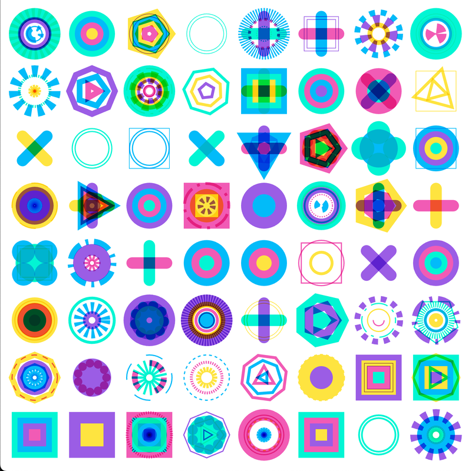

# Those Shape Things

> **⚠️ This repository has moved to a monorepo**
> 
> Active development now happens in the [GenArt Monorepo](https://github.com/MichaelPaulukonis/genart-monorepo).
> 
> This repository remains active **only** for GitHub Pages deployment. The source code here is no longer maintained.

---



## 🔗 Links

- **Live Demo:** [https://michaelpaulukonis.github.io/those-shape-things/](https://michaelpaulukonis.github.io/those-shape-things/)
- **Monorepo:** [https://github.com/MichaelPaulukonis/genart-monorepo](https://github.com/MichaelPaulukonis/genart-monorepo)
- **Source Code:** [apps/those-shape-things/](https://github.com/MichaelPaulukonis/genart-monorepo/tree/main/apps/those-shape-things)
- **Documentation:** [View in monorepo](https://github.com/MichaelPaulukonis/genart-monorepo/tree/main/apps/those-shape-things/README.md)

## About

Geometric tile-based compositions with customizable color palettes and shape patterns on an 8x8 grid.

Built with p5.js as part of the GenArt creative coding collection.

## Development

All development happens in the monorepo. To work on this project:

```bash
git clone https://github.com/MichaelPaulukonis/genart-monorepo.git
cd genart-monorepo
pnpm install
nx dev those-shape-things
```

See the [monorepo documentation](https://github.com/MichaelPaulukonis/genart-monorepo) for more details.

## License

MIT
